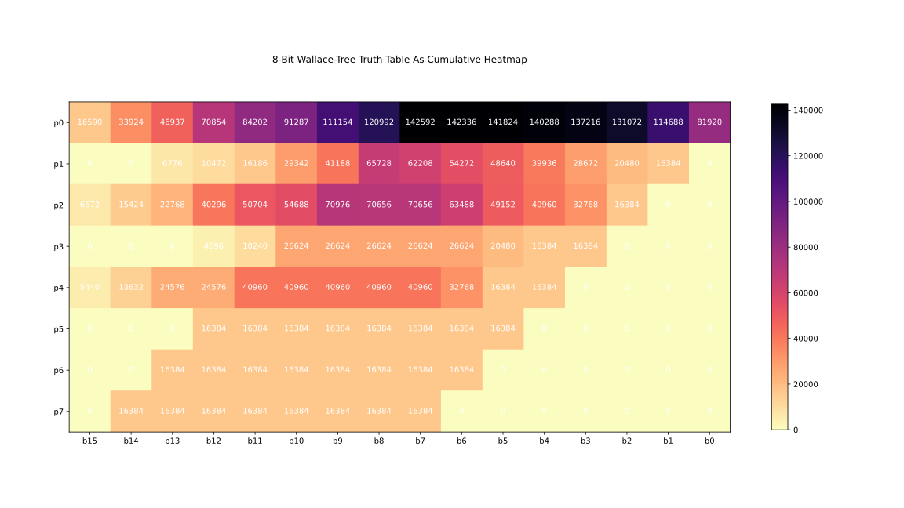
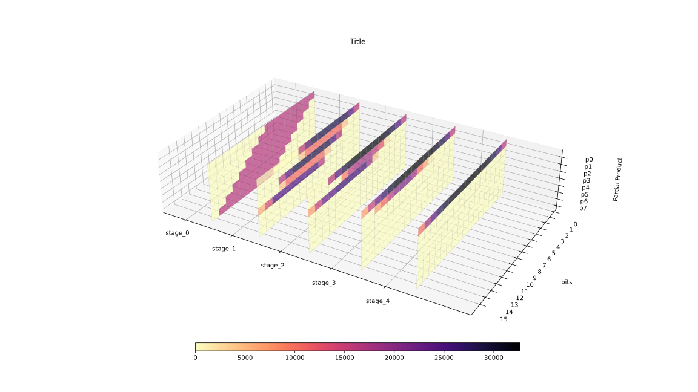
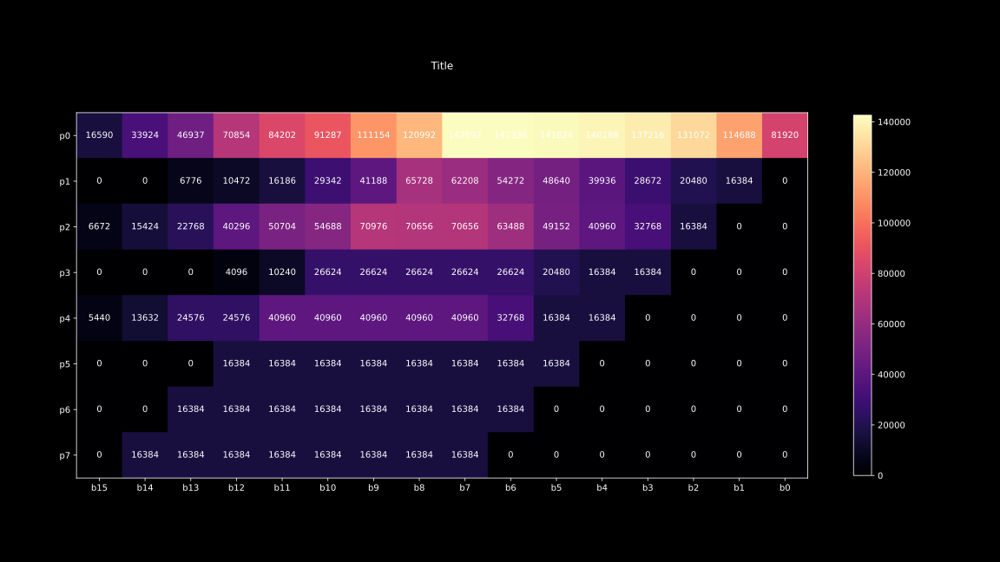
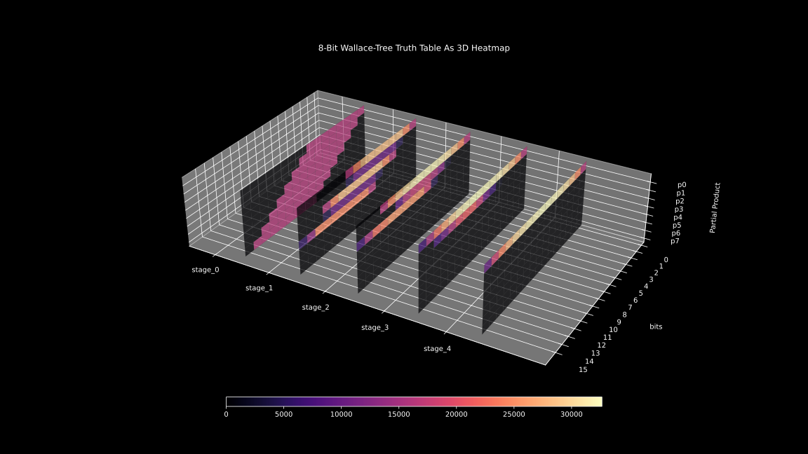

.. _intro:

============
Introduction
============

Multiplied is a library for exploring and quickly defining `combinational <https://en.wikipedia.org/wiki/Combinational_logic>`_
multiplication algorithms. The library also bundles built-in tools to analyse and
visualise algorithms through `Pandas <https://pandas.pydata.org/>`_ and `Matplotlib <https://matplotlib.org/>`_.

The Problem
-----------
Generating and analysing multiplier designs by hand is labour intensive, even for small datasets, for entire `truth tables <https://en.wikipedia.org/wiki/Truth_table>`__ it's close to impossible.

Multiplied is built to streamline this process:

- Custom partial product reduction via :ref:`templates <struct-template>`
- Generating complete truth tables
- Analysis, plotting, and managing datasets
- Fine-grain access to bits, words or stages

Pattern Based Algorithm
-----------------------

Multiplied uses an ``Algorithm`` object to group stages, each made up of a ``Template``, ``Matrix``, and a ``Map``.

- Patterns represent simple templates
- Automatic mapping based on empty rows
- "Pseudo" matrix to visualise possible bit positions for arithmetic outputs.

.. code:: python

    p = mp.Pattern(['a','a','b','b','c','c','d','d'])
    alg = mp.Algorithm(8)

    # detects pattern, generates Template and Map based on prior stage
    alg.push(p)
    print(alg)

.. code:: text

    0:{

    template:{

    ________AaAaAaAa
    _______aAaAaAaA_
    ______BbBbBbBb__
    _____bBbBbBbB___
    ____CcCcCcCc____
    ___cCcCcCcC_____
    __DdDdDdDd______
    _dDdDdDdD_______

    ______AaAaAaAaAa
    ________________
    ____BbBbBbBbBb__
    ________________
    __CcCcCcCcCc____
    ________________
    DdDdDdDdDd______
    ________________
    }

    pseudo:{

    ______AaAaAaAaAa
    ____BbBbBbBbBb__
    __CcCcCcCcCc____
    DdDdDdDdDd______
    ________________
    ________________
    ________________
    ________________
    }

    map:{

    00 00 00 00 00 00 00 00 00 00 00 00 00 00 00 00
    00 00 00 00 00 00 00 00 00 00 00 00 00 00 00 00
    FF FF FF FF FF FF FF FF FF FF FF FF FF FF FF FF
    00 00 00 00 00 00 00 00 00 00 00 00 00 00 00 00
    FE FE FE FE FE FE FE FE FE FE FE FE FE FE FE FE
    00 00 00 00 00 00 00 00 00 00 00 00 00 00 00 00
    FD FD FD FD FD FD FD FD FD FD FD FD FD FD FD FD
    00 00 00 00 00 00 00 00 00 00 00 00 00 00 00 00
    }

Automatic Template Generation
-----------------------------

Extend the previous single stage, pattern based algorithm using auto resolution:

.. code:: python

    alg.auto_resolve_stage(recursive=True)

Algorithm Execution
-------------------

With the algorithm object complete, you can execute it with the following code:

.. code:: python

    result = alg.exec(42, 255)

    for m in result.values():
        print(m)

    # convert result to decimal
    print(int("".join(alg.matrix.matrix[0]), 2))
    print(a*b)

.. code:: text

    ________00101010
    _______00101010_
    ______00101010__
    _____00101010___
    ____00101010____
    ___00101010_____
    __00101010______
    _00101010_______

    ______0011010110
    ______00010100__
    ___0011010110___
    ___00010100_____
    0001111110______
    ________________
    ________________
    ________________

    ___0011000110110
    _____00110100___
    00100010000_____
    ________________
    ________________
    ________________
    ________________
    ________________

    0010010110010110
    __0001000100____
    ________________
    ________________
    ________________
    ________________
    ________________
    ________________

    0010100111010110
    ________________
    ________________
    ________________
    ________________
    ________________
    ________________
    ________________

    10710
    10710

Analysis
--------

Generated data returns as a Pandas ``DataFrame`` ready for manipulation and vidualisation:

.. container:: code-variant-light

   .. code-block:: python

        import pandas as pd

        domain_ = (1, 255)  # range of possible operand values for a and b
        range_ = (1, 65535)  # range of possible output values
        scope = mp.truth_scope(domain_, range_)  # generator clamps range to domain

        # scope yields input tuples (a, b) to generate a Pandas DataFrame
        df = mp.truth_dataframe(scope, alg)

        # Generate cumulative heatmap of all stages
        mp.df_global_heatmap("example.svg", "Title", df)

        # Generate and stack 2d heatmaps of each stage
        mp.df_global_3d_heatmap("example3d.svg", "Title", df)

.. container:: code-variant-dark

    .. code-block:: python

        import pandas as pd

        domain_ = (1, 255)  # range of possible operand values for a and b
        range_ = (1, 65535)  # range of possible output values
        scope = mp.truth_scope(domain_, range_)  # generator clamps range to domain

        # scope yields input tuples (a, b) to generate a Pandas DataFrame
        df = mp.truth_dataframe(scope, alg)

        # Generate cumulative heatmap of all stages
        mp.df_global_heatmap("example.svg", "Title", df, dark=True)

        # Generate and stack 2d heatmaps of each stage
        mp.df_global_3d_heatmap("example3d.svg", "Title", df, dark=True)

